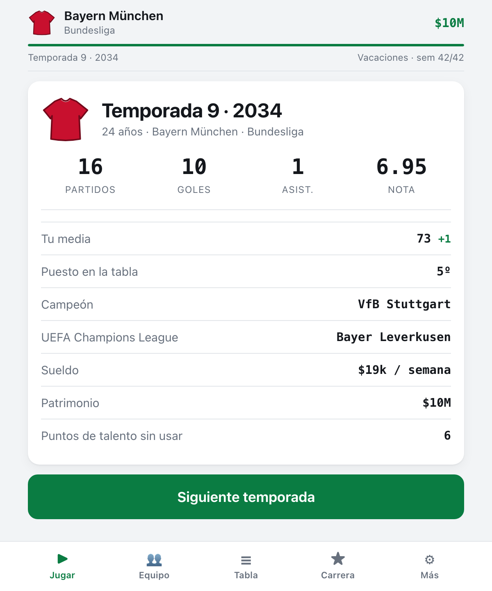

# POTRERO

[](https://github.com/JP7599/potrero/actions/workflows/ci.yml)
[](LICENSE)


Un modo carrera de fútbol que empieza a los 16 años en la última categoría del
país que elijas y termina, si aguantas, contigo sentado en un banco de
suplentes dirigiendo a otros.

Es la idea del modo carrera de siempre —creas un jugador, entrenas, juegas, te
transfieres— pero con todo lo que esos juegos dejan afuera: el sueldo real
después de impuestos, el representante que se lleva su tajada, los sponsors que
aparecen recién cuando eres famoso, la plata que se te va en vivir como crack,
los negocios donde metes lo que ganaste, la lesión que te comes por querer
aguantar los últimos diez minutos, y el día que cuelgas los chimpunes y tienes
que decidir si pagas el curso de entrenador con lo que juntaste.



## Jugar

**[jp7599.github.io/potrero](https://jp7599.github.io/potrero/)** — o abre
`docs/index.html`. No hay build, no hay servidor, no hay dependencias.

Eliges nombre, país, puesto y perfil (crack de barrio, obrero, cerebro, killer
del área) y arrancas desde abajo del todo.

**Carrera corta** es lo que viene por defecto: unas ochenta pantallas de los 16
al retiro, más o menos un rato largo de micro. El juego simula las 42 semanas de
cada temporada igual que siempre, pero solo te detiene donde de verdad decides
—la jugada que define un partido, un club que te viene a buscar, el cierre de
cada año— y al final te da una tarjeta para copiar y pegar en el grupo. Si te
gusta el detalle, **Carrera completa** te devuelve el semana a semana entero.
Cambian **en qué te detienes**, no cómo se simula: la misma semilla da
exactamente la misma carrera en los dos.

## Qué hay adentro

**36 países, 108 ligas, 1.287 clubes reales.** Todo Sudamérica, México, Estados
Unidos, Canadá, Costa Rica y veintidós países de Europa, cada uno con sus tres
categorías y su nombre real: Liga 1 y Copa Perú, Brasileirão y Série C, LaLiga,
Premier League, Serie A, Bundesliga. Los nombres y las ciudades salen de
[openfootball](https://github.com/openfootball/clubs) (dominio público, CC0);
las primeras divisiones de Sudamérica, las cinco grandes de Europa, Portugal,
Países Bajos, México y MLS están curadas a mano con su prestigio y su camiseta.

**Empiezas donde nadie te ve.** La tercera categoría de tu país son clubes de
barrio inventados sobre ciudades reales, distintos en cada carrera. De ahí se
sube por ascensos —los dos últimos bajan, los dos primeros suben, tu club
incluido— y por fichajes hacia ligas más fuertes del mundo.

**Dos formas de empezar.** Firmar en un club de la Copa Perú y jugar desde el
primer fin de semana en canchas de tierra, o entrar a la cantera de un club de
Primera: sueldo de mentira y reserva todos los sábados, pero entrenas el doble
y si rindes te suben al primer equipo. Si a los 20 no subiste, te dan la carta
de libertad y vuelves a empezar más abajo.

**Cada club con su camiseta.** Los escudos reales son marca registrada y no se
reproducen acá; lo que sí se reconoce al toque son los colores: la banda de
Boca, la cruzada de River, el rayado de Peñarol, el blaugrana, los aros del
Flamengo. Cada camiseta es un SVG dibujado por código, así que no hay ni una
imagen en el repositorio y escala igual a 22px en una tabla que a 60px en la
cabecera.

**El mundo entero juega.** Todas las categorías corren su liga de ida y vuelta,
su copa nacional por eliminación y, las de arriba, la Libertadores, la Champions
o la Concacaf Champions Cup. El mundo sigue girando juegues o no: solo la liga
donde estás metido tiene jugadores uno por uno, el resto se simula a nivel club
para que mil clubes entren en el navegador sin llenarte el disco.

**La semana.** Entrenas técnica, gimnasio o video, descansas, haces
fisioterapia, sales en la prensa, sales de noche, ves a tu familia, estudias
idiomas o revisas tus negocios. Cada opción tiene costo: la fiesta sube el
ánimo y baja todo lo demás, la prensa te da fama y te puede regalar un
escándalo.

**El partido.** Los minutos no te los regala nadie: dependen de tu media contra
la de tus compañeros de puesto, de la confianza del técnico y de tu forma. Si
entras, el partido te para y te hace elegir. Cada opción muestra su probabilidad
real calculada con tus atributos, y la panenka fallada te va a perseguir.

En carrera corta esas jugadas no salen en cualquier partido: salen en tu debut,
en el clásico, en la final, en la fecha que define el título — y si el año viene
gris y no hubo ninguna, el juego igual te para una vez, porque ninguna temporada
se pasa entera sin que la pelota sea tuya.

**Sin internet y sin cuenta.** Hubo una versión que le pedía las jugadas a un
modelo por API. Se sacó: cada momento tardaba entre diez y doce segundos, y una
semana de carrera se juega en dos. Todo el juego corre en tu navegador, sin key,
sin costo y sin esperar.

**La plata.** Sueldo semanal escalado al nivel de cada liga (de $50 por semana
en la Copa Perú a seis cifras en la élite), impuestos según el país, comisión
del representante, costo de vida según cómo elijas vivir, primas por gol y por
firmar. Lo que sobra lo puedes meter en bonos, ladrillo, una pollería con tu
nombre (rinde si eres famoso, quiebra si te olvidan), una academia de menores
que paga poco y te suma galones de DT, o una cripto que puede hacerte rico o
meme.

**La carrera.** Creces hacia un potencial que no ves —solo tienes la estimación
de un ojeador que se equivoca—, te llaman de la selección si rindes, ganas
títulos, y a partir de los 30 el juego te empieza a preguntar si sigues. Cada
año cierra con una pantalla que mira hacia atrás: tus números, dónde terminó tu
equipo, cuánto subiste de media, qué levantaste. El Balón de Oro existe, pero
hay que ganárselo en una primera división y con una temporada de crack; desde
la Copa Perú no te llega ni la invitación.

**El banco.** Cuando te retiras, pagas el curso de entrenador con tu propia
plata (más barato si te pasaste la carrera viendo video en vez de saliendo).
Después diriges: formación, estilo —posesión le gana al contragolpe, el
contragolpe a la presión alta, la presión alta a la posesión—, mentalidad, once
inicial, entrenamiento semanal, fichajes con presupuesto, ruedas de prensa
donde puedes defender al plantel o mandar al frente a la dirigencia, y una
barra de paciencia de los dirigentes que baja con cada derrota hasta que te
botan.

## Honestidad sobre la simulación

Los partidos son Poisson con lambdas que salen de la diferencia de fuerza entre
los equipos, más localía. La fuerza de un equipo son sus once mejores más un
plus por infraestructura. Tu rendimiento personal es una normal alrededor de tu
media, corregida por forma, ánimo, físico, localía y qué tan difícil es el
rival; de ahí salen la nota, los goles y las asistencias. Nada de esto pretende
ser un modelo del fútbol real: pretende que las decisiones que tomas se noten
en el resultado y que no puedas romper el juego eligiendo siempre lo mismo.

Todo es determinista a partir de una semilla. Si pones la misma semilla y tomas
las mismas decisiones, sale exactamente la misma carrera.

Las semanas que la carrera corta resuelve sola no se saltean: se juegan con el
mismo motor y con las mismas decisiones sensatas que tomarías tú (al fisio si
estás lesionado, a descansar si vienes fundido, a entrenar si no). Eso importa
más de lo que parece — cuando el piloto automático entrenaba siempre, el jugador
llegaba fundido a todos los partidos, bajaba la nota, la nota bajaba la forma y
la forma bajaba la nota otra vez, hasta dejar a un crack promediando 5.0 y con
la mitad de los goles que le tocaban.

## Tests

```bash
node tests.mjs
```

Verifican lo que se puede verificar: que el round robin sea un round robin de
verdad (todos contra todos, once de local y once de visitante), que en cada
liga los goles a favor sumen igual que los goles en contra, que partir un
partido en dos tiempos dé los mismos goles esperados que jugarlo entero (si eso
se rompe, el modo DT queda desbalanceado y pierdes partidos por un bug), que el
equipo que diriges se mida en la misma escala que el rival, que después de
treinta temporadas ningún plantel apunte a un jugador que no existe y nadie
esté en dos clubes a la vez, que retirar un negocio no cree ni destruya
patrimonio, que una carrera entera —de los 16 al último banco— se pueda jugar de
principio a fin sin romperse, y que un crack termine con nota de crack y goles
de crack, para que la espiral de arriba no vuelva a colarse.

## Notas

La partida se guarda sola en el navegador. Como `localStorage` no siempre
funciona abriendo el archivo directo desde el disco, hay botones de Exportar e
Importar para llevarte la carrera en un archivo. Las partidas de la v0.1 no
cargan: el mundo cambió entero.

Los nombres de clubes y ciudades vienen de
[openfootball/clubs](https://github.com/openfootball/clubs), publicado bajo CC0
(dominio público). El resto —camisetas, prestigios, economía y todo el juego—
es de acá. `scripts/` tiene los generadores que arman `docs/mundo.js`, por si
hay que rehacerlo.

Los clubes y los torneos llevan su nombre real, pero acá no hay ni un escudo:
los escudos son marca registrada de cada club y no se reproducen. Este es un
proyecto personal sin fines comerciales, sin licencia de nadie y sin relación
con ninguno de los clubes que aparecen.

MIT. Sin dependencias, sin build, sin assets: seis archivos de JavaScript y un
HTML.
